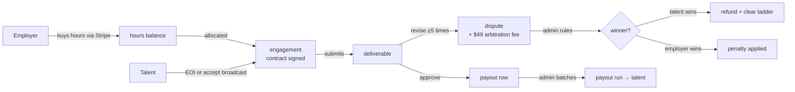
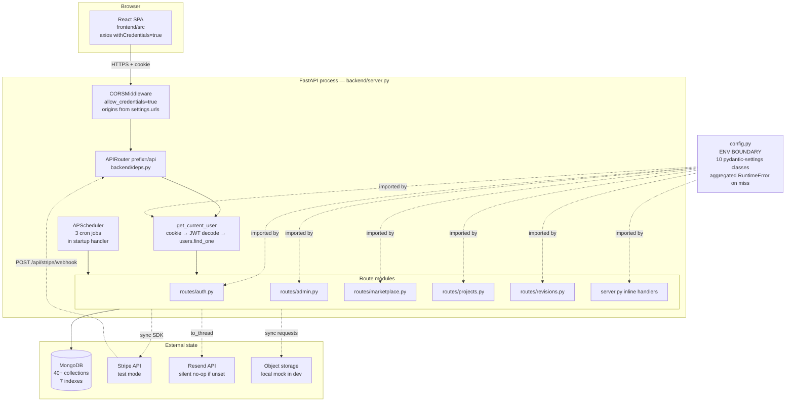

# ENGINEERING_HANDBOOK.md — Job Atlas

The single doc a working engineer keeps open. Consolidates the pieces from
`ARCHITECTURE.md`, `CLAUDE.md`, `PROJECT_STATUS.md`, and `SECURITY_BACKLOG.md`
that you need in the working set. Every claim was verified against the code at
the time of writing; where a claim can't be verified from the code, it is
called out inline.

Sensitive-material sections (security-posture buckets, contractor strategy)
have been split into `docs/INTERNAL_STRATEGY.md` — read that separately, and
only if you're on the trust boundary that requires it.

**Table of contents**

1. [What Job Atlas is](#1-what-job-atlas-is)
2. [Stack and request path](#2-stack-and-request-path)
3. [Money flow — atomic vs racy](#3-money-flow--atomic-vs-racy)
4. [Hard invariants](#4-hard-invariants)
5. [Test and dev stacks](#5-test-and-dev-stacks)
6. [Test coverage](#6-test-coverage)
7. [Directory map](#7-directory-map)
8. Security posture — moved to `docs/INTERNAL_STRATEGY.md §1` (NDA-only)
9. Contractor strategy — moved to `docs/INTERNAL_STRATEGY.md §2` (NDA-only)
10. [Working style and definition of done](#10-working-style-and-definition-of-done)
11. [Index of the other docs](#11-index-of-the-other-docs)

---

## 1. What Job Atlas is

Job Atlas (brand: Geminista, operator: Denkoit Softech Pvt. Ltd.) is a
two-sided marketplace where **employers hire specialist talent by the hour for
short engagements**. Product surface derived from `FEATURES.md` (23 sections).

**Employers** buy blocks of hours through Stripe Checkout (`starter_10` /
`growth_50` / `scale_100` / `enterprise_500`, plus bank transfer). They browse
talent, shortlist candidates, send "broadcasts" (hire-intent messages), accept
talent-initiated EOIs, sign a contract, receive deliverables, and either
approve or request revisions. Larger work runs as a **project** with milestones
— each milestone is its own Stripe invoice with a card-on-file auto-collect
path when overdue.

**Talent** builds a verified profile (reference-check BGV, KYB for companies,
curated onboarding), gets discovered via SEO landing pages + broadcasts + EOI,
submits deliverables, gets paid via an admin-triggered payout run, and accrues
"Trusted Partner" / "Proven Reliable" badges.

**Admin** is a scope-gated console: `support`, `finance`, `moderation`,
`customization`, `superadmin`. Scope catalog lives in `backend/deps.py`.

### Marketplace lifecycle



Money always moves one way: employer → hours balance → engagement allocation →
approved deliverable → payout row → payout run. Refunds are the only reversal.

---

## 2. Stack and request path

FastAPI (single process, Motor + APScheduler in-process) · MongoDB · React 18
SPA on craco · Stripe (test-mode in dev). All routes register on the shared
`api = APIRouter(prefix="/api")` from `backend/deps.py`.



**Request path (authenticated route):**

1. Uvicorn accepts → Starlette → CORS middleware.
2. Router matches on the shared `api` prefix.
3. `Depends(get_current_user)` reads the `access_token` cookie (cookie-only
   post-S-26 close, commit `cabf1d0`), JWT-decodes with HS256, projects
   `password_hash` and `_id` out of the `users.find_one`. One Mongo
   round-trip per authenticated request.
4. Handler body role / scope check (`_require_scope(user, "<scope>")` or
   direct `user["role"] == "..."`).
5. Motor async Mongo calls.
6. JSON serialised by FastAPI's default encoder.

**Config is the environment boundary.** `backend/config.py` is the *only*
module in `backend/` that reads `os.environ`. Every other module imports
`settings` and reads typed attributes. Enforced by an AST scan in
`backend/tests/test_config.py::test_no_module_outside_config_reads_os_environ`.
Same rule frontend-side (`frontend/src/config.js` is the only `process.env.REACT_APP_*`
reader).

Deeper detail lives in `ARCHITECTURE.md`.

---

## 3. Money flow — atomic vs racy

Two code paths credit `hours_balance` after a Stripe Checkout completes: the
webhook `POST /api/stripe/webhook`, and the frontend polling loop that hits
`GET /api/payments/status/{session_id}` from `PaymentSuccess.jsx`. Both fire
for a normal completion — the polling path is a fallback for missed webhooks.
Only one of them is atomically correct.

```mermaid
sequenceDiagram
    autonumber
    participant Stripe
    participant PS as PaymentSuccess.jsx<br/>(polling)
    participant WH as POST /api/stripe/webhook<br/>(server.py:590-595)
    participant STAT as GET /api/payments/status/{sid}<br/>(_credit_hours_if_paid<br/> server.py:520-537)
    participant DB as MongoDB

    Note over Stripe,DB: Both branches fire on a normal completion.

    par webhook branch — S-03(c) TOCTOU
        Stripe->>WH: checkout.session.completed
        WH->>DB: find_one(session_id) — Python-level snapshot
        WH->>DB: update_one({$ne: "paid"}, $set paid)
        Note right of WH: NOT gated on update result
        WH->>DB: $inc hours_balance UNCONDITIONALLY
    and polling branch — atomic
        PS->>STAT: poll every 2s
        STAT->>Stripe: Session.retrieve(sid)
        STAT->>DB: find_one_and_update({$ne: "paid"}, $set paid)
        alt update matched
            STAT->>DB: $inc hours_balance
        else already paid
            STAT-->>PS: return current record, no $inc
        end
    end

    Note over WH,DB: Two concurrent webhook deliveries both pass the Python<br/>check; only one atomic update wins, but BOTH $inc. Bug.
```

### The safe branch — `_credit_hours_if_paid` at `server.py:520-537`

Uses `find_one_and_update` and gates every side effect on the update result.
Verified verbatim:

```python
async def _credit_hours_if_paid(record: dict, session_obj) -> dict:
    if record.get("payment_status") == "paid":
        return record
    if session_obj.payment_status == "paid" or session_obj.status == "complete":
        upd = await db.payment_transactions.find_one_and_update(
            {"session_id": record["session_id"], "payment_status": {"$ne": "paid"}},
            {"$set": {"status": "completed", "payment_status": "paid",
                      "updated_at": now().isoformat()}},
            return_document=True,
        )
        if upd:                                            # ← gate on winner
            await db.users.update_one({"id": record["user_id"]},
                                      {"$inc": {"hours_balance": record["hours"]}})
            ...
```

### The racy branch — webhook default at `server.py:590-595`

```python
rec = await db.payment_transactions.find_one({"session_id": obj["id"]})
if rec and rec.get("payment_status") != "paid":               # ← Python snapshot
    await db.payment_transactions.update_one(
        {"session_id": obj["id"], "payment_status": {"$ne": "paid"}},
        {"$set": {"status": "completed", "payment_status": "paid",
                  "updated_at": now().isoformat()}})
    await db.users.update_one({"id": rec["user_id"]},
                              {"$inc": {"hours_balance": rec["hours"]}})
    # ↑ runs whether the update matched anything or not
```

The Python-level `payment_status != "paid"` check can be true for multiple
concurrent handlers (Stripe retry + polling call, or two workers behind a load
balancer). Exactly one atomic `update_one` matches — but every concurrent
handler that passed the snapshot check still runs the `$inc`. Result: double
credit under normal Stripe retry behaviour.

The empirical canary is `test_10_hours_purchase.py::test_concurrent_replay_may_double_credit`
(xfail `strict=False`; outcome depends on Mongo serialisation timing). The
fix — gate the `$inc` on `update_one.modified_count == 1` the same way the
polling branch already does — is tracked as S-03(c). Do not touch either
branch without fixing both together.

### Two other webhook branches

Same file, same handler:

- `kind == "milestone"` branch updates `payment_transactions`, `project_milestones.status="paid"`,
  and `project_invoices.status="paid"`. All three under the `$ne: "paid"` guard. Follow-on writes are idempotent `$set`s — no `$inc`, so the same TOCTOU has no money-loss vector today, but if any future change adds an `$inc` (e.g. commissions, ledger, credit-hours-back) it inherits the S-03(c) bug.
- `kind == "dispute_fee"` branch late-imports `mark_dispute_fee_paid` from `routes.revisions` and calls it inside a `try/except`. The except now `logger.exception(...)`s (used to be a bare `pass`) but the handler still returns `{"ok": True}` to Stripe. If Mongo is briefly unavailable, Stripe records delivery as successful but the fee never gets marked paid. Tracked as S-03(a); the empirical canary is `test_stripe_fixtures.py::test_dispute_fee_branch_raises_5xx_when_helper_throws`.

---

## 4. Hard invariants

Verbatim from `CLAUDE.md` at the time of writing. If this list drifts from
`CLAUDE.md`, the source of truth is `CLAUDE.md` — send a PR to reconcile.

1. Every app-level PK is `str(uuid.uuid4())` via `new_id()` (`deps.py`). Never expose Mongo `_id`.
2. Every read projects `{"_id": 0}`.
3. Auth is the httpOnly `access_token` cookie set at login (`deps.py:set_auth_cookies`).
   `deps.py:get_current_user` reads the cookie and nothing else — S-26 removed the legacy
   `Authorization: Bearer` branch (regression guard: `backend/tests/test_s26_no_bearer.py`).
   Never move a token into localStorage or a URL. The single legitimate `?token=` query-param
   use is the SSE `/talent/me/broadcasts/stream` endpoint, which does its own inline
   `jwt.decode` scoped to that route (regression guard: `backend/tests/test_s26_sse_still_works.py`)
   — do not generalise that pattern.
4. Route modules import from `deps` only. `routes/*` → `server.py` imports must stay **inside handler
   bodies** (cycle break, see `admin.py:129,188,197`). Never hoist them to module level.
5. `routes/engagements.py` is a placeholder — its docstring lists endpoints that BELONG there but
   currently live in `server.py`. Do not add endpoints there until F-03 physically extracts them.
6. Any new admin endpoint uses `_require_scope(user, "<scope>")`. `role == "admin"` alone is a bug.
7. CSRF protection: the middleware from S-01 is **not yet registered** (test at
   `test_csrf_surface.py` currently skips with an S-01 note). The exemption policy is already
   locked in at `security/csrf_exempt.yml` — exact (method, path) pairs with a written
   justification per entry. Adding an entry requires the same review as a P0 change. When the
   S-01 middleware lands, it must consult this file, not accept its own exemption list.
8. New collection ⇒ new index in the startup block (`server.py`, the `@app.on_event("startup")`
   handler around the index-creation cluster near the bottom of the file). No exceptions.
9. No new synchronous network/PDF call inside `async def`. Wrap in `asyncio.to_thread` or use `httpx`.
   Legacy sync `requests` / `urllib` in `storage_client.py`, `work_integrations.py`,
   `routes/auth.py::_validate_crm_token` is tracked as S-13; don't grow the list.
10. Money paths are append-only + idempotent. Never delete a `payment_transactions` row.
11. `backend/config.py` is the **only** module that reads the process environment (`os.environ`,
    `os.getenv`). Enforced by `backend/tests/test_config.py::test_no_module_outside_config_reads_os_environ`
    (AST scan of `backend/`). Same rule on the frontend: `frontend/src/config.js` is the only
    reader of `process.env.REACT_APP_*`. Missing required vars fail boot with a single aggregated
    `RuntimeError` listing every gap.

---

## 5. Test and dev stacks

Two Docker Compose stacks, deliberately distinct compose projects so they can
run at once.

| Aspect | Test stack (`atlas-test`) | Dev stack (`atlas-dev`) |
| --- | --- | --- |
| Compose file | `docker-compose.test.yml` | `docker-compose.dev.yml` |
| Env file | `.env.test` (not committed) | `.env.dev` (from `.env.dev.example`) |
| Backend port (host) | `18443` (HTTPS) | `8443` (HTTPS) |
| Frontend port (host) | `13000` | `3000` |
| Mongo | container-only (tmpfs, wiped on down) | `27017` published (named volume, persists) |
| Stripe | `stripe-mock` container | real `api.stripe.com`, test mode; webhooks via `stripe listen` |
| Storage | `storage-mock` container | `storage-mock` container (no real provider wired) |
| Turnstile | Cloudflare published test keys | your keys or the published test keys |
| Uvicorn `--reload` | off (determinism) | on (edit backend/, container picks up) |
| Frontend HMR bind-mounts | none (bundle stable) | `frontend/src`, `public`, config files |

### Commands (Makefile)

Every target below was confirmed to exist in `Makefile` and to do what it says.

- `make up-test` / `make down-test` — boot / tear down the test stack (mongo tmpfs wiped).
- `make seed` — populate synthetic data into the test stack (idempotent).
- `make test-backend` — run backend/tests inside the backend container (see §6).
- `make e2e` — run Playwright specs from the host after resetting mutable collections + reseeding.
- `make coverage-gaps` — combine pytest coverage with the backend-process coverage, regenerate `docs/scripts/.artifacts/coverage.json`, run the gap report.
- `make verify` — `test-backend` + `test-frontend` + `e2e` + `security-scan`. Today `test-frontend` and `security-scan` are placeholders that always pass; the real gates are `test-backend` and `e2e`.
- `make up-dev` — boot the dev stack. Refuses to run if `.env.dev` is missing.
- `make down-dev` — stop the dev stack. Mongo volume **preserved**.
- `make down-dev-hard` — down + drop the mongo volume. Loses every account you clicked through.
- `make seed-dev` — seed the same personas as the test stack.
- `make dev-logs` — tail all dev-stack container logs.

### First-boot traps

- **Mongo cold-start race.** First `make up-dev` may log a transient
  `ServerSelectionTimeoutError` and the admin seeder can no-op. Retry
  `make down-dev && make up-dev`; if still stuck, `make down-dev-hard` then
  `make up-dev`.
- **Chrome self-signed cert.** Backend HTTPS on `:8443` uses a self-signed
  cert. First API call fails with `ERR_CERT_AUTHORITY_INVALID`. Visit
  `https://localhost:8443/api/marketplace/industries`, click **Advanced →
  Proceed**, trust sticks for the session.
- **Port conflicts on 3000 / 27017.** Local `yarn start` or `mongod` will
  collide. Stop the local process, or edit `ports:` in
  `docker-compose.dev.yml`.
- **`.local` email rejected.** Pydantic `EmailStr` (via python-email-validator)
  refuses `.local` (RFC 6762 mDNS reserved). Setting `ADMIN_EMAIL=admin@dev.local`
  makes the seeded admin unloginable. Keep the example's `admin@example.com`
  (RFC 2606 reserved for docs).
- **Service worker cache.** `frontend/public/sw.js` caches the app shell for
  offline load. After a UI edit, a hard reload can still serve the cached
  shell. Fix: DevTools → Application → Service Workers → **Unregister**, then
  Cmd-Shift-R. Or incognito.
- **`STRIPE_WEBHOOK_SECRET` rotates every `stripe listen` run.** Copy the new
  `whsec_…` from `stripe listen`'s first output line into `.env.dev`, then
  `make down-dev && make up-dev`.
- **bcrypt version warning noise.** `seed.py` and boot log
  `AttributeError: module 'bcrypt' has no attribute '__about__'` — passlib 1.7
  vs bcrypt 4.x. Harmless; H-5 in `PROJECT_STATUS.md §5`, closes when we pin
  `bcrypt<4`.

Full walkthrough: `docs/LOCAL_SETUP.md`.

---

## 6. Test coverage

Verified by running `make test-backend` and `make e2e` at the time of writing.

### Backend

```
321 collected
├─ 313 passed
├─   3 failed  (S-11 canaries — see below)
├─   4 xfailed (self-clearing canaries — see below)
└─   1 skipped (invariant test parked on S-01)
```

Runs from `make test-backend`. The modules exercised are enumerated in the
Makefile recipe; the legacy `test_iteration*.py` and `backend_test.py` are
excluded (H-6 in `PROJECT_STATUS.md §5`).

### Playwright

```
13 passed (0 failed)
```

Runs from `make e2e`, which first resets mutable collections via
`backend/tests/e2e_reset.py` then reseeds via `backend/tests/seed.py`.

### What's covered

Auth (register / login / logout / cookie attrs) · marketplace + shortlist +
broadcast · EOI + accept · engagement sign/deliver/approve · revision ladder
+ dispute + refund audit · grievances · hours purchase (Stripe fixture-signed
webhooks) · milestone payments · config-boundary AST scan · `public_routes.yml`
and `csrf_exempt.yml` ratchets · scanner unit tests.

### What's not covered

Frontend unit tests (none exist). Real cloud storage (mock only). LLM
behaviour (`ai_service.py` uses a shim in the test image). CI runner not
wired — `make verify` runs locally only.

### Self-clearing canaries

Four `pytest.mark.xfail` decorators in the backend suite. Each documents a
known gap and self-clears (`xpass`) when the gap is closed. Verified by
reading each decorator inline.

| Test | Strict | Reason | Clears when |
| --- | --- | --- | --- |
| `test_stripe_fixtures.py::TestS03DisputeFeeBranchSwallowsErrors::test_dispute_fee_branch_raises_5xx_when_helper_throws` | `True` | S-03(a) — dispute-fee webhook branch wraps `mark_dispute_fee_paid` in try/except and returns `{"ok": True}` even on helper failure | webhook branch stops swallowing and returns 500 (or an error) so Stripe retries |
| `test_10_hours_purchase.py::TestConcurrentReplay::test_concurrent_replay_may_double_credit` | `False` | S-03(b) + S-03(c) — concurrent webhooks for the same session race the Python `payment_status != "paid"` check; each winner still `$inc`s hours_balance | webhook branch gates `$inc` on `update_one.modified_count == 1` (matches the polling branch); `strict=False` because Mongo serialisation timing can mask the race |
| `test_10_hours_purchase.py::TestChargeRefundedReversal::test_charge_refunded_reverses_hours_credit` | `True` | Webhook has no `charge.refunded` branch; refunds fall through to the outer `return {"ok": True}` and `hours_balance` stays credited | a `charge.refunded` handler branch lands that reverses the `$inc` |
| `test_14_grievances_refunds.py::test_verify_detects_tampering_via_recompute` | `True` | S-04 — verify endpoint does a plain `find_one({signature})` lookup, never recomputes `_refund_audit_signature` over the current rows; a tampered row with a matching stored sig still verifies | verify endpoint switches to `hmac.new + compare_digest` recompute over current data |

Plus the three S-11 cross-tenant tests in `test_11_engagements.py`
(`TestDeliverablesCreate` / `TestDeliverableApprove` / `TestDeliverableReject`
— each `test_cross_tenant_..._returns_404_per_s11`). These are **not** marked
xfail — they fail loudly as red tests documenting the S-11 gap, per the
module's opening docstring. They clear when the `load_owned(collection, id,
user)` helper lands and cross-tenant reads return 404 instead of 403.

The one skip is in `test_csrf_surface.py` (invariant #7) with an explicit
S-01 note: the test flips on as soon as `app.add_middleware(*CSRF*)` appears
in `backend/server.py`.

---

## 7. Directory map

One line per significant file. Full inventory: `docs/ENDPOINT_INVENTORY.md`.

**Backend**
- `backend/server.py` (2,906 lines) — the kitchen sink. Most routes still live here (F-03 will split). App bootstrap, CORS middleware, Stripe webhook, hours purchase, engagements/deliverables, EOI, SEO pages, curated talent constant, APScheduler config.
- `backend/deps.py` — singletons: Motor `client`, `db`, `api = APIRouter(prefix="/api")`, JWT helpers, `get_current_user`, `set_auth_cookies`, admin-scope catalog, `has_admin_scope`, `LEGACY_INDUSTRY_MAP`.
- `backend/config.py` — sole env boundary. Ten nested pydantic-settings classes; `_build_settings()` aggregates missing-var errors into one `RuntimeError`.
- `backend/routes/auth.py` — auth + email verification + BGV + reference checks + CRM.
- `backend/routes/admin.py` — admin console. Cycle-breaks into `server.py` via late imports at `admin.py:129,188,197`.
- `backend/routes/marketplace.py` — marketplace metadata + shortlist CRUD + sitemap.
- `backend/routes/projects.py` — projects, milestones, invoices, auto-collect, overdue scanner.
- `backend/routes/revisions.py` — revision ladder, disputes, dispute-fee, refund, audit PDF.
- `backend/routes/engagements.py` — **shell file, dead**. Docstring lists endpoints that live in `server.py`.
- `backend/ai_service.py` — LLM rate suggest. Imports `emergentintegrations` behind a `try/except ImportError` (F-01 closed, commit `9ba2368`); routes to the rule-based fallback when the package is absent.
- `backend/mailer.py` — Resend wrapper; silent no-op when `RESEND_API_KEY` unset.
- `backend/storage_client.py` — object-storage client (dev = local mock; no real cloud provider wired).
- `backend/work_integrations.py` — Monday/Asana/Trello/ClickUp/Jira/Confluence adapters. Six sync `requests` sites.
- `backend/pricing.py` — currently unimported (`coverage_gaps.py` reports 0% coverage). Historical.
- `backend/tests/` — pytest suite. `seed.py` builds the six personas; `conftest.py` autouse-drops Mongo per test; `sitecustomize.py` redirects Stripe to stripe-mock in the test image only; `stripe_fixtures.py` builds signed webhook payloads; `e2e_reset.py` clears mutable collections between Playwright runs; `_storage_mock/app.py` is the in-memory storage-mock.

**Frontend**
- `frontend/src/App.js` — router + provider tree + Sonner toasts mount.
- `frontend/src/config.js` — sole env-var reader (`REACT_APP_*`). Renders a red banner and throws when `REACT_APP_BACKEND_URL` is unset (F-08 close).
- `frontend/src/context/AuthContext.jsx` — auth state: `null` = loading, `false` = guest, object = logged in.
- `frontend/src/lib/api.js` — axios instance + `formatErr`. No global response interceptor (S-16).
- `frontend/src/pages/` — one file per route.
- `frontend/src/components/ProtectedRoute.jsx` — role gate. Admin bypasses all role checks.
- `frontend/src/legal/content.js` — static legal content used by `Legal.jsx`, `SubProcessors.jsx`, `DPIA.jsx`.
- `frontend/src/constants/testIds.js` — Playwright data-testid catalog.
- `frontend/e2e/` — Playwright specs `00-smoke` through `06-purchase-hours`, plus `personas.js` (mirrors `seed.py`) and `helpers.js`.
- `frontend/public/sw.js` — service worker, caches app shell (see §5 trap).

**Repo root**
- `docker-compose.test.yml` — hermetic test stack (mocks, tmpfs mongo).
- `docker-compose.dev.yml` — dev stack (real Stripe test-mode + Resend + Turnstile).
- `backend/Dockerfile.test` — reused by both stacks. Bakes `sitecustomize.py` into site-packages and generates a self-signed cert into `/certs`. Post-F-01 the `emergentintegrations` shim is no longer injected — the runtime import is optional.
- `frontend/Dockerfile.test` — reused by both stacks. Runs `yarn start` (dev server, HMR-capable).
- `Makefile` — every target listed in §5.
- `.env.example` — template for the test/prod-style env.
- `.env.dev.example` — template for the dev stack (git-tracked; `.env.dev` is git-ignored).
- `security/csrf_exempt.yml` + `security/public_routes.yml` — policy files the invariant tests ratchet against.
- `docs/scripts/` — AST scanners (`route_scan.py`, `features_scan.py`, `render_inventory.py`, `coverage_gaps.py`, `diff.py`) + `tests/test_scanner.py`.
- Root docs: `CLAUDE.md` (invariants + working style), `ARCHITECTURE.md` (deep tour), `FEATURES.md` (23 feature sections), `PROJECT_STATUS.md` (phase state + closure log), `SECURITY_BACKLOG.md` (S/F items), `CONTRACTOR_SPLIT.md`, `VALIDATION_PROCESS.md`, `NATIVE_APP_GUIDE.md`, `test_result.md` (status_history log).

---

## 8. Security posture

Moved to `docs/INTERNAL_STRATEGY.md §1` — **NDA-only.** That document contains
the bucketed breakdown of every S- and F- item, fix order, and the argument
for the sequence. If you don't have access to it, you don't need it for the
work in front of you. If you do need it, request access separately.

## 9. Contractor strategy

Moved to `docs/INTERNAL_STRATEGY.md §2` — **NDA-only.** Covers the tiered
model (crown jewels / sensitive / neutral / public), the three sharing
patterns (frontend-with-mock, plugin repo + wheel, full-trust hire), non-
negotiable controls, and the currently shareable work packages.

---

## 10. Working style and definition of done

From `CLAUDE.md`; kept here so a working engineer doesn't need to context-
switch.

- **One backlog item per branch, one branch per PR.** Branch name = backlog id
  (e.g. `sec/S-26-drop-bearer`, `feat/F-04-scheduler-tab`).
- **Failing test first, then the fix.** Backend tests under `backend/tests/`,
  browser tests under `frontend/e2e/`.
- **One domain per PR.** Auth, money, projects, revisions, admin — pick one.
- **`make verify` green before merge.** Today that's `test-backend` + `e2e`
  (the other two legs are placeholders).
- **Commit and push at the end of every session.** Even WIP. Long-lived local
  branches drift from docs.
- **Never commit `.env`, seed dumps, Stripe keys, or credentials.** `.env.*`
  is git-ignored; the two `.env*.example` files are the only tracked ones.
  Gitleaks runs in CI (or will, once §5's Phase 1d wires it).

### Definition of done for any task

- [ ] Behaviour matches the relevant `FEATURES.md` section (or that section is updated).
- [ ] Test added under `backend/tests/` (pytest+httpx) or `frontend/e2e/` (Playwright).
- [ ] `test_result.md` `status_history` appended per the protocol block in that file.
- [ ] No new entry in `SECURITY_BACKLOG.md` introduced; if the change closes one, mark it CLOSED with the fix commit sha.
- [ ] `make verify` green.

### Landmines (do not "fix" by accident)

Full list in `CLAUDE.md`. Short recap of the two most likely to bite:

- The two hours-crediting paths (webhook and polling) look symmetric but the webhook branch has S-03(c) — see §3.
- `emergentintegrations` is now an optional import (F-01 closed, commit `9ba2368`) — `ai_service.py` wraps it in `try/except ImportError` and falls back to rule-based rates. A fresh `pip install -r backend/requirements.txt` succeeds; no shim needed.

---

## 11. Index of the other docs

Root-level:

| Doc | What it's for |
| --- | --- |
| `CLAUDE.md` | Constitution: 11 invariants, working style, definition of done, landmines. |
| `ARCHITECTURE.md` | Deep backend tour: boot sequence, module map, request lifecycle, data model, money flow, integrations, async correctness. |
| `FEATURES.md` | 23-section feature inventory. Every user-visible surface with endpoints + manual test steps. |
| `PROJECT_STATUS.md` | Phase state, hardening programme, closure log, harness debt table. |
| `SECURITY_BACKLOG.md` | Ranked S-/F- items. Read via `docs/INTERNAL_STRATEGY.md §1` unless you're doing the fix. |
| `CONTRACTOR_SPLIT.md` | How to hire without shipping the moat. Summarised in `docs/INTERNAL_STRATEGY.md §2`. |
| `VALIDATION_PROCESS.md` | Phase 1a–1d harness/CI programme. |
| `NATIVE_APP_GUIDE.md` | Capacitor mobile-shell notes. |
| `test_result.md` | Append-only `status_history` log of test outcomes per task. Read for context on how a subsystem got where it is. |

Under `docs/`:

| Doc | What it's for |
| --- | --- |
| `docs/TEAM_ONBOARDING.md` | Day-one guide — the fastest path from "just cloned" to "clicked through the flows". |
| `docs/LOCAL_SETUP.md` | Long-form dev-stack walkthrough: signups, key → env var mapping, troubleshooting. |
| `docs/CONFIG_INVENTORY.md` | Per-env-var provenance table. Source of truth for names + which service they belong to. |
| `docs/ENDPOINT_INVENTORY.md` | AST-derived endpoint catalog. Regenerable via `docs/scripts/render_inventory.py`. |
| `docs/UNDOCUMENTED_ROUTES.md` | Routes present in code but not in `FEATURES.md`. Regenerable via `docs/scripts/diff.py`. |
| `docs/INTERNAL_STRATEGY.md` | **NDA-only.** Security posture buckets + contractor strategy. |
| `docs/scripts/` | Runnable scanners the docs above are derived from. |

Everything above this heading is safe to share with a frontend or backend
contractor working against the mock. `docs/INTERNAL_STRATEGY.md` is not.
